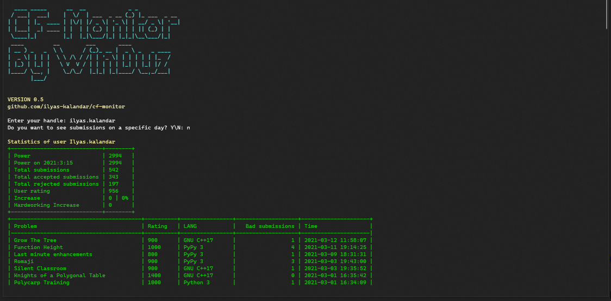

# CF-Monitor
A simple script for monitoring user on Codeforces  
 

## How to run ?
### First, we <b>need</b> to install some python packages.  

### Install requests, tabulate, colorama
## Windows
<code>pip --user install requests tabulate colorama </code>
## Linux/macOS
<code>pip3 --user install requests tabulate colorama</code>

### Run script
## Windows
<code>py main.py</code>
## Linux/macOS
<code>python3 main.py</code>

### How to use ? 
After launch, you will immediately receive an invitation to enter a nickname  
So, enter nickname and press enter  

After these manipulations, you will notice that the program asks you "whether to monitor a specific day of the user" 
You can say no by Enter no, No, or blablabla or you can say "Yes" by enter "yes", "y", "yeah" and any word which start with 'y' 

If you say "yes", you must enter date, you can press enter to keep the default values (datetime.now()) 

## That's all! With Love, Ilyas Kalandar
