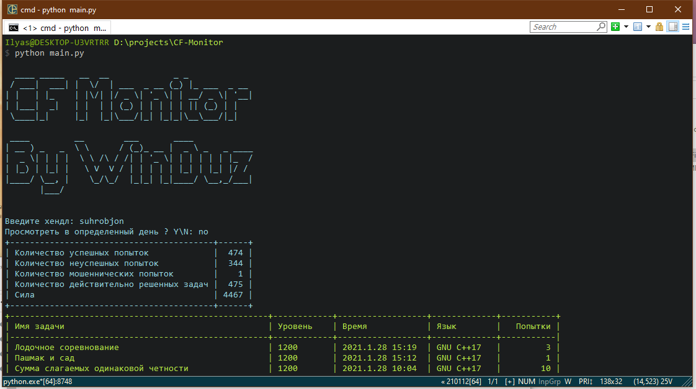
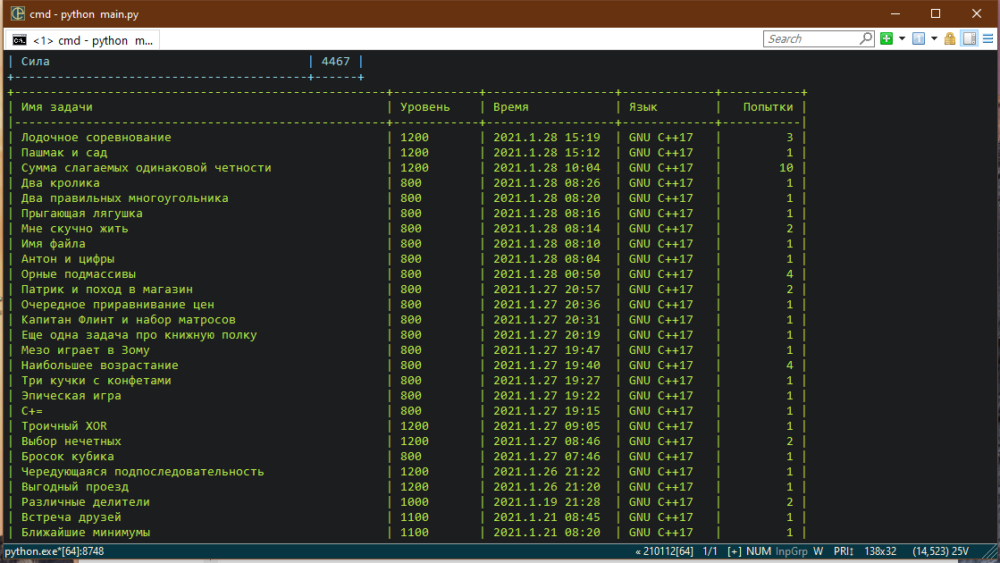

# CF-Monitor
A simple script for monitoring user on Codeforces  
Простой скрипт, при помощи которого можно мониторить какого-либо пользователя на Codeforces

## How to run ?
### First, we <b>need</b> to install some python packages.  

## Как запустить ?
### Для начала необходимо установить несколько python-пакетов.

### Install requests, tabulate, colorama/Установите библиотеки requests, tabulate и colorama
## Windows
<code>pip --user install requests tabulate colorama </code>
## Linux/macOS
<code>pip3 --user install requests tabulate colorama</code>

### Run script/Запуск
## Windows
<code>py main.py</code>
## Linux/macOS
<code>python3 main.py</code>

### How to use ? / Как использовать
After launch, you will immediately receive an invitation to enter a nickname  
После запуска, вы сразу увидите приглашение ввести ник пользователя на codeforces  
So, enter nickname and press enter  
Введите имя и нажмите ENTER   

After these manipulations, you will notice that the program asks you "whether to monitor a specific day of the user" 
После этих манипуляций, вы заметите что программа спрашивает у вас "промониторить ли конкретный день пользователя" 
You can say no by Enter no, No, or blablabla or you can say "Yes" by enter "yes", "y", "yeah" and any word which start with 'y' 
Вы можете сказать нет напечатав No, no, n или любое другое слово, также вы можете сказать да прописав yes, yeah или любое другое слово начинающееся на 'y' 

If you say "yes", you must enter date, you can press enter to keep the default values (datetime.now()) 
Если вы ответили "yes", то вы должны ввести дату, вы можете просто нажать enter, для пропуска конкретного поля, значение будет дефолтным (то есть сегодня) 

## That's all! With Love, Ilyas Kalandar
